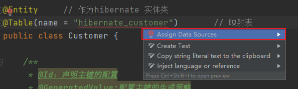
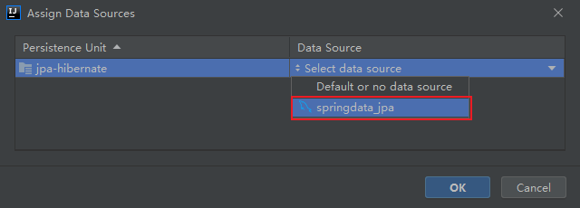
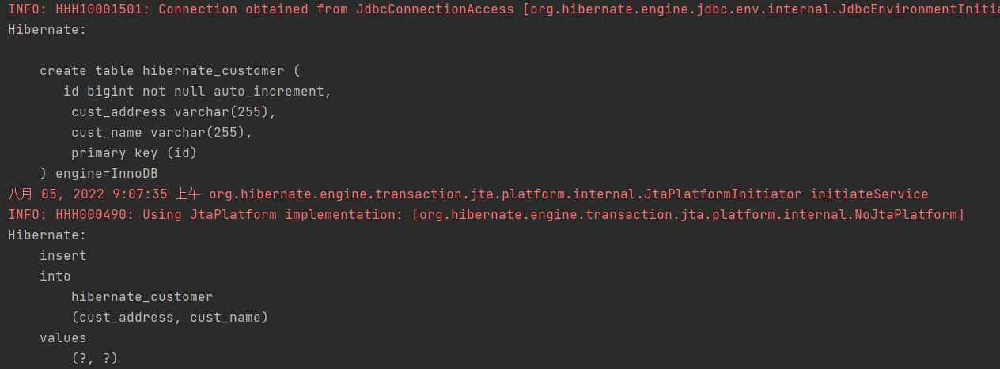
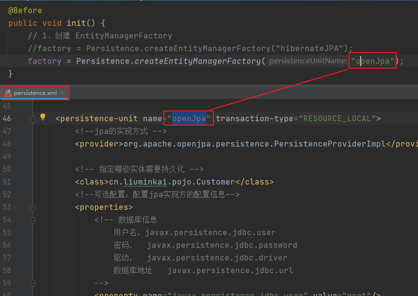
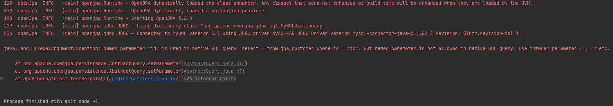
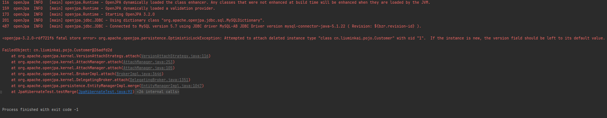
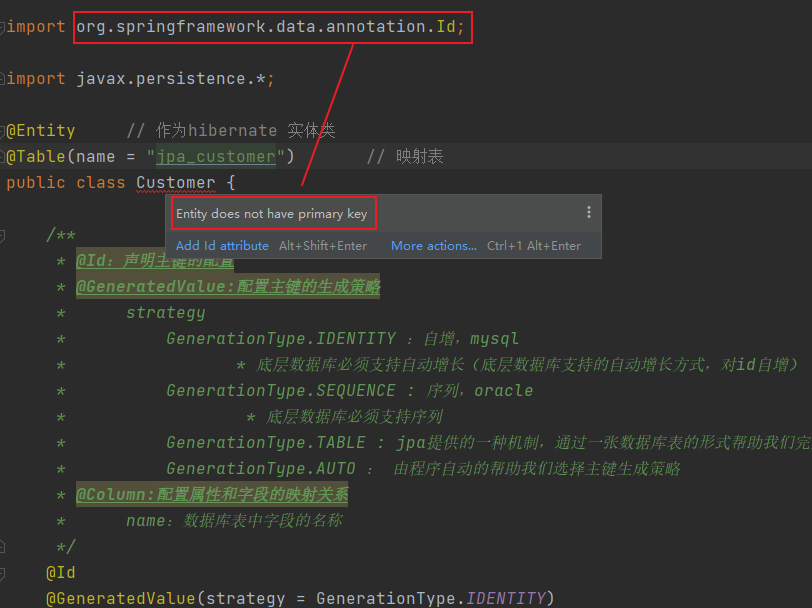

## hibernate 示例
### 1、pom.xml引入依赖
```xml
    <dependencies>
        <!-- junit4 -->
        <dependency>
            <groupId>junit</groupId>
            <artifactId>junit</artifactId>
            <version>4.13</version>
            <scope>test</scope>
        </dependency>
        <!-- hibernate对jpa的支持包 -->
        <dependency>
            <groupId>org.hibernate</groupId>
            <artifactId>hibernate-entitymanager</artifactId>
            <version>5.4.32.Final</version>
        </dependency>

        <!-- Mysql and MariaDB -->
        <dependency>
            <groupId>mysql</groupId>
            <artifactId>mysql-connector-java</artifactId>
            <version>5.1.22</version>
        </dependency>
        <!-- openjpa JPA的实现之一 -->
        <dependency>
            <groupId>org.apache.openjpa</groupId>
            <artifactId>openjpa-all</artifactId>
            <version>3.2.0</version>
        </dependency>
    </dependencies>
```

### 2、创建实体类
```java

@Entity     // 作为hibernate 实体类
@Table(name = "hibernate_customer")       // 映射表
public class Customer {

    /**
     * @Id：声明主键的配置
     * @GeneratedValue:配置主键的生成策略
     *      strategy
     *          GenerationType.IDENTITY ：自增，mysql
     *                 * 底层数据库必须支持自动增长（底层数据库支持的自动增长方式，对id自增）
     *          GenerationType.SEQUENCE : 序列，oracle
     *                  * 底层数据库必须支持序列
     *          GenerationType.TABLE : jpa提供的一种机制，通过一张数据库表的形式帮助我们完成主键自增
     *          GenerationType.AUTO ： 由程序自动的帮助我们选择主键生成策略
     * @Column:配置属性和字段的映射关系
     *      name：数据库表中字段的名称
     */
    @Id
    @GeneratedValue(strategy = GenerationType.IDENTITY)
    @Column(name = "id")
    private Long custId; //客户的主键

    @Column(name = "cust_name")
    private String custName;//客户名称

    @Column(name="cust_address")
    private String custAddress;//客户地址

    public Long getCustId() {
        return custId;
    }

    public void setCustId(Long custId) {
        this.custId = custId;
    }

    public String getCustName() {
        return custName;
    }

    public void setCustName(String custName) {
        this.custName = custName;
    }


    public String getCustAddress() {
        return custAddress;
    }

    public void setCustAddress(String custAddress) {
        this.custAddress = custAddress;
    }

    @Override
    public String toString() {
        return "Customer{" +
                "custId=" + custId +
                ", custName='" + custName + '\'' +
                ", custAddress='" + custAddress + '\'' +
                "}\n";
    }
}

```


> @Table 注解 name 会报红，等后面的 3、4、5、都执行完后，选中波浪线，选择数据源
>
> 
>
> 

### 3、hibernate配置文件，resources/hibernate.cfg.xml
在resources目录下创建hibernate.cfg.xml配置文件，文件内容如下

- 主要配置
    - 配置数据库连接信息
    - 数据库方言配置，选择 MySQL
    - hbm2ddl.auto 生成表的策略选择update
    - 指定需要进行ORM的包
```xml
<?xml version="1.0" encoding="UTF-8"?>
<!DOCTYPE hibernate-configuration PUBLIC
        "-//Hibernate/Hibernate Configuration DTD 3.0//EN"
        "http://www.hibernate.org/dtd/hibernate-configuration-3.0.dtd">
<hibernate-configuration>
    <session-factory>
        <!-- 配置数据库连接信息 -->
        <property name="connection.driver_class">com.mysql.jdbc.Driver</property>
        <property name="connection.url">jdbc:mysql://localhost:3306/springdata_jpa?characterEncoding=UTF-8</property>
        <property name="connection.username">root</property>
        <property name="connection.password">123456</property>

        <!-- 会在日志中记录sql 默认false-->
        <property name="show_sql">true</property>
        <!--是否格式化sql 默认false-->
        <property name="format_sql">true</property>
        <!--表生成策略
            默认none   不自动生成
            update    如果没有表会创建，有会检查更新
            create    每次删除表，再创建表，即使没有改变
            create-drop 每次创建表，sessionFactory关闭，就删除表
            validate 每次验证数据库表结构，只会与表进行比较，不会创建新表，但是会插入新值
            -->
        <property name="hbm2ddl.auto">update</property>
        <!-- 配置方言：选择数据库类型 -->
        <property name="dialect">org.hibernate.dialect.MySQL57InnoDBDialect</property>

        <!--指定哪些pojo类 需要进行ORM映射-->
        <mapping class="cn.liuminkai.pojo.Customer"></mapping>
    </session-factory>
</hibernate-configuration>
```
### 4、创建数据库
> 整个示例下啦，我们不行要创建表，等到调用save保存数据时会自动创建表和插入数据，但是需要预先创建数据库
>
> 

创建数据库 "springdata_jpa"

code first（代码优先）：不需要创建表，只需要关心pojo类，但是需要创建数据库


### 5、使用 hibernate api 完成增删改查（测试类中进行）

find、merge 修改 持久态 的实体对象，修改会被同步到数据库中

> **步骤：**
>
> 1.创建 SessionFactory
>
> 2.
#### 5.1、新增
```java
/**
 * StandardServiceRegistry 作用
 * MetadataSources 作用
 * SessionFactory 作用
 * Session 作用
 */
public class HibernateTest {

    private SessionFactory sf;

    @Before
    public void init() {
        // 1、创建SessionFactory
        StandardServiceRegistry registry = new StandardServiceRegistryBuilder().configure("/hibernate.cfg.xml").build();
        sf = new MetadataSources(registry).buildMetadata().buildSessionFactory();
    }


    /*
        注意事项：
            （1）修改完数据需要，调用session.close()关闭会话，数据才会被持久化到数据库中
     */

    // 2、使用 hibernate-api 进行 crud
    /**
     * 2.1、新增数据
     */
    @Test
    public void testSave() {
        Transaction transaction = null;
        // 创建hibernate session对象
        try(Session session = sf.openSession();) {
            // 开启事务
            transaction = session.beginTransaction();

            // 保存数据
            Customer customer = new Customer();
            customer.setCustName("张三");
            customer.setCustAddress("Beijing");
            session.save(customer);

            // 提交事务
            transaction.commit();
        } catch (Exception e) {
            // 事务回滚
            transaction.rollback();
        }
    }
}
```

#### 5.2、查询


#### 5.3、修改


#### 5.4、删除

save
saveOrUpdate 有id更新，无id吃ARU
find
update
remove

测试(hql使用) hql 与 jpql 区别
session.createQuery.getResultList

## jpa集成hibernate
拷贝hibernate模块内容可以不要 resources/hibernate.cfg.xml

### 1、添加 resourcesMETA—INF/persistence.xml
persistence.xml需要配置的内容和hibernate.cfg.xml差不多，就是需要指定一下 JPA的实现方式
- 主要配置
    - 指定JPA的实现方式
    - 配置数据库连接信息
    - 数据库方言配置，选择 MySQL
    - hbm2ddl.auto 生成表的策略选择update
    - 指定需要进行ORM的包
    
```xml
<?xml version="1.0" encoding="UTF-8"?>
<persistence xmlns="http://java.sun.com/xml/ns/persistence" version="2.0">
    <!--需要配置persistence-unit节点
        持久化单元：
            name：持久化单元名称
            transaction-type：事务管理的方式
                    JTA：分布式事务管理
                    RESOURCE_LOCAL：本地事务管理
    -->
    <persistence-unit name="hibernateJPA" transaction-type="RESOURCE_LOCAL">
        <!--jpa的实现方式 -->
        <provider>org.hibernate.jpa.HibernatePersistenceProvider</provider>
        <!--需要进行ORM的POJO类-->
        <class>cn.liuminkai.pojo.Customer</class>

        <!--可选配置：配置jpa实现方的配置信息-->
        <properties>
            <!-- 数据库信息
                用户名，javax.persistence.jdbc.user
                密码，  javax.persistence.jdbc.password
                驱动，  javax.persistence.jdbc.driver
                数据库地址   javax.persistence.jdbc.url
            -->
            <property name="javax.persistence.jdbc.user" value="root"/>
            <property name="javax.persistence.jdbc.password" value="123456"/>
            <property name="javax.persistence.jdbc.driver" value="com.mysql.jdbc.Driver"/>
            <property name="javax.persistence.jdbc.url" value="jdbc:mysql://localhost:3306/springdata_jpa?characterEncoding=UTF-8"/>

            <!--配置jpa实现方(hibernate)的配置信息
                显示sql           ：   false|true
                自动创建数据库表    ：  hibernate.hbm2ddl.auto
                        create      : 程序运行时创建数据库表（如果有表，先删除表再创建）
                        update      ：程序运行时创建表（如果有表，不会创建表）
                        none        ：不会创建表

            -->
            <property name="hibernate.show_sql" value="true" />
            <property name="hibernate.hbm2ddl.auto" value="update" />
            <property name="hibernate.dialect" value="org.hibernate.dialect.MySQL5InnoDBDialect" />

        </properties>
    </persistence-unit>


    <persistence-unit name="openJpa" transaction-type="RESOURCE_LOCAL">
        <!--jpa的实现方式 -->
        <provider>org.apache.openjpa.persistence.PersistenceProviderImpl</provider>

        <!-- 指定哪些实体需要持久化 -->
        <class>cn.liuminkai.pojo.Customer</class>
        <!--可选配置：配置jpa实现方的配置信息-->
        <properties>
            <!-- 数据库信息
                用户名，javax.persistence.jdbc.user
                密码，  javax.persistence.jdbc.password
                驱动，  javax.persistence.jdbc.driver
                数据库地址   javax.persistence.jdbc.url
            -->
            <property name="javax.persistence.jdbc.user" value="root"/>
            <property name="javax.persistence.jdbc.password" value="123456"/>
            <property name="javax.persistence.jdbc.driver" value="com.mysql.jdbc.Driver"/>
            <property name="javax.persistence.jdbc.url" value="jdbc:mysql://localhost:3306/springdata_jpa?characterEncoding=UTF-8"/>

            <!--配置jpa实现方(openjpa)的配置信息
            -->
            <!-- 可以自动生成数据库表 -->
            <property name="openjpa.jdbc.SynchronizeMappings" value="buildSchema(ForeignKeys=true)"/>
        </properties>
    </persistence-unit>

</persistence>
```
### 2、使用 jpa 完成增删改查（测试类中进行）
测试（JPA使用）
Persistence.createEnMF

persist
find（立即查询）
getRef（延迟查询）
merge （没有saveOrUpdate接口，只更新可以用jpql）
remove （直接删除，报删除游离状态异常，只能删除持久化状态（从数据库中查出的状态就是持久化状态））

JPQL
em.createQuery
    使用sql语句
        createNativeQuery

### 3、 实现切换为openJpa
#### 3.1、引入依赖
```xml
        <!-- openjpa JPA的实现之一 -->
        <dependency>
            <groupId>org.apache.openjpa</groupId>
            <artifactId>openjpa-all</artifactId>
            <version>3.2.0</version>
        </dependency>
```

#### 3.2、切换实现

切换 持久化单元



openJDK测试 testSelectSQL 会抛出异常



openJDK测试 testMerge 
    openJPA 实现，没有id就是插入，有id时，必须保证记录是存在的，存在才能更新，否则抛出异常



## jpa 4种状态
- 临时
- 持久，对持久状态的更改会对数据库进行同步
  - 只要修改，提交就会，被持久化，即使是find
  - 1. find -> 修改实体 -> commit
  - 2. find -> remove -> persist -> commit 不懂：p9 7:00
  - 
- 删除
- 游离

## jpa 缓存
### 1、一级缓存 基于EntityManager 
### 2、二级缓存


## spring-data-jpa 简化jpa的框架
### 1、引入依赖
#### 1.1、为了方便管理spring-data的依赖，在父模块code中引入如下依赖：
```xml
    <!--统一管理SpringData子项目的版本-->
    <dependencyManagement>
        <dependencies>
            <dependency>
                <groupId>org.springframework.data</groupId>
                <artifactId>spring-data-bom</artifactId>
                <version>2021.1.0</version>
                <scope>import</scope>
                <type>pom</type>
            </dependency>
        </dependencies>
    </dependencyManagement>
```

#### 1.2、子模块都引入
```xml
<dependencies>
    <dependency>
        <groupId>org.springframework.data</groupId>
        <artifactId>spring-data-jpa</artifactId>
    </dependency>

    <!-- junit4 -->
    <dependency>
        <groupId>junit</groupId>
        <artifactId>junit</artifactId>
        <version>4.13</version>
        <scope>test</scope>
    </dependency>
    <!-- hibernate对jpa的支持包 -->
    <dependency>
        <groupId>org.hibernate</groupId>
        <artifactId>hibernate-entitymanager</artifactId>
        <version>5.4.32.Final</version>
    </dependency>

    <!-- Mysql and MariaDB -->
    <dependency>
        <groupId>mysql</groupId>
        <artifactId>mysql-connector-java</artifactId>
        <version>5.1.22</version>
    </dependency>

    <!--连接池-->
    <dependency>
        <groupId>com.alibaba</groupId>
        <artifactId>druid</artifactId>
        <version>1.2.8</version>
    </dependency>

    <!--spring-test -->
    <dependency>
        <groupId>org.springframework</groupId>
        <artifactId>spring-test</artifactId>
        <version>5.3.10</version>
        <scope>test</scope>
    </dependency>

    <!-- querydsl -->
    <dependency>
        <groupId>com.querydsl</groupId>
        <artifactId>querydsl-jpa</artifactId>
        <version>4.4.0</version>
    </dependency>

</dependencies>
```

### 2、配置
#### 2.1、xml方式
##### spring.xml
```xml
<?xml version="1.0" encoding="UTF-8"?>
<beans xmlns="http://www.springframework.org/schema/beans"
       xmlns:xsi="http://www.w3.org/2001/XMLSchema-instance"
       xmlns:jpa="http://www.springframework.org/schema/data/jpa" xmlns:tx="http://www.springframework.org/schema/tx"
       xsi:schemaLocation="http://www.springframework.org/schema/beans
    https://www.springframework.org/schema/beans/spring-beans.xsd
    http://www.springframework.org/schema/data/jpa
    https://www.springframework.org/schema/data/jpa/spring-jpa.xsd http://www.springframework.org/schema/tx http://www.springframework.org/schema/tx/spring-tx.xsd">

    <!--用于整合jpa  @EnableJpaRepositories -->
    <jpa:repositories base-package="cn.liuminkai.repository"
                      transaction-manager-ref="transactionManager"
                      entity-manager-factory-ref="entityManagerFactory"/>

    <!--EntityManagerFactory-->
    <bean name="entityManagerFactory" class="org.springframework.orm.jpa.LocalContainerEntityManagerFactoryBean">
        <property name="jpaVendorAdapter">
            <!--Hibernate实现-->
            <bean class="org.springframework.orm.jpa.vendor.HibernateJpaVendorAdapter">
                <!--生成数据库表-->
                <property name="generateDdl" value="true"></property>
                <property name="showSql" value="true"></property>
            </bean>
        </property>
        <!--设置实体类的包-->
        <property name="packagesToScan" value="cn.liuminkai.pojo"></property>
        <property name="dataSource" ref="dataSource" ></property>
    </bean>

    <!--数据源-->
    <bean class="com.alibaba.druid.pool.DruidDataSource" name="dataSource">
        <property name="username" value="root"/>
        <property name="password" value="123456"/>
        <property name="driverClassName" value="com.mysql.jdbc.Driver"/>
        <property name="url" value="jdbc:mysql://localhost:3306/springdata_jpa?characterEncoding=UTF-8"/>
    </bean>

    <!--声明式事务-->
    <bean class="org.springframework.orm.jpa.JpaTransactionManager" name="transactionManager">
        <property name="entityManagerFactory" ref="entityManagerFactory"></property>
    </bean>

    <!--启动注解方式的声明式事务-->
    <tx:annotation-driven transaction-manager="transactionManager"></tx:annotation-driven>

</beans>
```

##### 创建pojo.Customer
```java
@Entity     // 作为hibernate 实体类
@Table(name = "tb_customer")       // 映射表
public class Customer {

    /**
     * @Id：声明主键的配置
     * @GeneratedValue:配置主键的生成策略
     *      strategy
     *          GenerationType.IDENTITY ：自增，mysql
     *                 * 底层数据库必须支持自动增长（底层数据库支持的自动增长方式，对id自增）
     *          GenerationType.SEQUENCE : 序列，oracle
     *                  * 底层数据库必须支持序列
     *          GenerationType.TABLE : jpa提供的一种机制，通过一张数据库表的形式帮助我们完成主键自增
     *          GenerationType.AUTO ： 由程序自动的帮助我们选择主键生成策略
     * @Column:配置属性和字段的映射关系
     *      name：数据库表中字段的名称
     */
    @Id
    @GeneratedValue(strategy = GenerationType.IDENTITY)
    @Column(name = "id")
    private Long custId; //客户的主键

    @Column(name = "cust_name")
    private String custName;//客户名称

    @Column(name="cust_address")
    private String custAddress;//客户地址

    public Long getCustId() {
        return custId;
    }

    public void setCustId(Long custId) {
        this.custId = custId;
    }

    public String getCustName() {
        return custName;
    }

    public void setCustName(String custName) {
        this.custName = custName;
    }


    public String getCustAddress() {
        return custAddress;
    }

    public void setCustAddress(String custAddress) {
        this.custAddress = custAddress;
    }

    @Override
    public String toString() {
        return "Customer{" +
                "custId=" + custId +
                ", custName='" + custName + '\'' +
                ", custAddress='" + custAddress + '\'' +
                "}\n";
    }
}
```

##### 创建repository.CustomerRepository
- 不需要使用@Repository或@Component注解，SpringDataJpa在编译时，会使用反射创建CustomerRepository的实现类，并装配到Spring容器中
- JpaRepository 是 Jpa 的Repository接口之一，具有 PagingAndSortingRepository，CrudRepository，QueryByExampleExecutor 的功能
```java
public interface CustomerRepository extends JpaRepository<Customer, Long> {
}
```

##### 测试类测试
简单的使用repository-api
```java
@ContextConfiguration("/spring.xml") // 指明spring上下文配置文件
@RunWith(SpringJUnit4ClassRunner.class)
public class JpaXmlTest {

    @Autowired
    private CustomerRepository customerRepository;

    /**
     * 保存
     */
    @Test
    public void testSave() {
        Customer customer = new Customer();
        customer.setCustId(3L);
        customer.setCustName("WangWu");
        customer.setCustAddress("Beijing");
        Customer c = customerRepository.save(customer);
        System.out.println(c);
    }
}

```


###### 启动报错：

java.lang.IllegalStateException: Failed to load ApplicationContext

Caused by: org.springframework.beans.factory.BeanCreationException: Error creating bean with name 'entityManagerFactory' defined in class path resource [spring.xml]: Invocation of init method failed; nested exception is org.hibernate.AnnotationException: No identifier specified for entity: cn.liuminkai.pojo.Customer

原因：处在Customer这个类上，注解Id使用错误，应该是 `javax.persistence.Id`，删掉 `import org.springframework.data.annotation.Id;` 即可



#### 2.2、javaConfig
##### config.JpaConfig
```java
/**
 <!--用于整合jpa  @EnableJpaRepositories -->
 <jpa:repositories base-package="cn.liuminkai.repository"
 transaction-manager-ref="transactionManager"
 entity-manager-factory-ref="entityManagerFactory"></jpa:repositories>
 */
@Configuration
@EnableJpaRepositories("cn.liuminkai.repository") // @EnableJpaRepositories 相当于 jpa:repositories，里面的属性都一致
/**
    <!--启动注解方式的声明式事务-->
    <tx:annotation-driven transaction-manager="transactionManager"></tx:annotation-driven>
 */
@EnableTransactionManagement // 启动注解方式的声明式事务
public class JpaConfig {

    /**
     <!--EntityManagerFactory-->
     <bean name="entityManagerFactory" class="org.springframework.orm.jpa.LocalContainerEntityManagerFactoryBean">
        <property name="jpaVendorAdapter">
            <!--Hibernate实现-->
            <bean class="org.springframework.orm.jpa.vendor.HibernateJpaVendorAdapter">
            <!--生成数据库表-->
                <property name="generateDdl" value="true"></property>
                <property name="showSql" value="true"></property>
            </bean>
        </property>
         <!--设置实体类的包-->
         <property name="packagesToScan" value="cn.liuminkai.pojo"></property>
         <property name="dataSource" ref="dataSource" ></property>
     </bean>
     */
    @Bean
    public LocalContainerEntityManagerFactoryBean entityManagerFactory() {
        // EntityManagerFactory
        LocalContainerEntityManagerFactoryBean factory = new LocalContainerEntityManagerFactoryBean();
        // Hibernate实现
        HibernateJpaVendorAdapter adapter = new HibernateJpaVendorAdapter();
        // 生成数据库表
        adapter.setGenerateDdl(true);
        // 控制台打印SQL
        adapter.setShowSql(true);
        factory.setJpaVendorAdapter(adapter);
        // 设置实体类的包
        factory.setPackagesToScan("cn.liuminkai.pojo");
        // 设置数据源
        factory.setDataSource(dataSource());
        return factory;
    }

    /**
     <!--数据源-->
     <bean class="com.alibaba.druid.pool.DruidDataSource" name="dataSource">
         <property name="username" value="root"/>
         <property name="password" value="123456"/>
         <property name="driverClassName" value="com.mysql.jdbc.Driver"/>
         <property name="url" value="jdbc:mysql://localhost:3306/springdata_jpa?characterEncoding=UTF-8"/>
     </bean>
     */
    @Bean
    public DataSource dataSource() {
        // 数据源
        DruidDataSource dataSource = new DruidDataSource();
        dataSource.setDriverClassName("com.mysql.jdbc.Driver");
        dataSource.setUrl("jdbc:mysql://localhost:3306/springdata_jpa?characterEncoding=UTF-8");
        dataSource.setUsername("root");
        dataSource.setPassword("123456");
        return dataSource;
    }

    /**
        <!--声明式事务-->
        <bean class="org.springframework.orm.jpa.JpaTransactionManager" name="transactionManager">
            <property name="entityManagerFactory" ref="entityManagerFactory"></property>
        </bean>
     */
    @Bean
    public PlatformTransactionManager transactionManager(EntityManagerFactory entityManagerFactory) {
        JpaTransactionManager transactionManager = new JpaTransactionManager();
        transactionManager.setEntityManagerFactory(entityManagerFactory);
        return transactionManager;
    }

}
```
##### 直接拷贝 jpa-01-config-xml 的repository和pojo

##### 测试类测试
```java
@ContextConfiguration(classes = JpaConfig.class) // 指明spring上下文配置文件
@RunWith(SpringJUnit4ClassRunner.class)
public class JpaJavaConfigTest {

    @Autowired
    private CustomerRepository customerRepository;

    /**
     * 保存
     */
    @Test
    public void testSave() {
        Customer customer = new Customer();
        customer.setCustName("WangWu");
        customer.setCustAddress("Beijing");
        Customer c = customerRepository.save(customer);
        System.out.println(c);
    }
}

```

### 3、repository api的使用
repo.delete(customer); 底层会帮我们先查询一下（游离=>持久），再删除
CrudRepository
PagingAndSortRepository
    PageRequest.
    Sort. 
        两种：字符串硬编码、type-safe
#### Repository
```java
@Indexed
public interface Repository<T, ID> {}
```
#### CrudRepository
```java
@NoRepositoryBean
public interface CrudRepository<T, ID> extends Repository<T, ID> {
    
	<S extends T> S save(S entity);
	<S extends T> Iterable<S> saveAll(Iterable<S> entities);
	Optional<T> findById(ID id);
	boolean existsById(ID id);
	Iterable<T> findAll();
	Iterable<T> findAllById(Iterable<ID> ids);
	long count();
	void deleteById(ID id);
	void delete(T entity);
	void deleteAllById(Iterable<? extends ID> ids);
	void deleteAll(Iterable<? extends T> entities);
	void deleteAll();
}

```
#### PagingAndSortingRepository
```java
@NoRepositoryBean
public interface PagingAndSortingRepository<T, ID> extends CrudRepository<T, ID> {

	Iterable<T> findAll(Sort sort);
	Page<T> findAll(Pageable pageable);
}
```

#### JpaRepository （常用）
```java
@NoRepositoryBean
public interface JpaRepository<T, ID> extends PagingAndSortingRepository<T, ID>, QueryByExampleExecutor<T> {

	@Override
	List<T> findAll();
	@Override
	List<T> findAll(Sort sort);
	@Override
	List<T> findAllById(Iterable<ID> ids);
	@Override
	<S extends T> List<S> saveAll(Iterable<S> entities);
	void flush();
	<S extends T> S saveAndFlush(S entity);
	<S extends T> List<S> saveAllAndFlush(Iterable<S> entities);
	@Deprecated
	default void deleteInBatch(Iterable<T> entities){deleteAllInBatch(entities);}
	void deleteAllInBatch(Iterable<T> entities);
	void deleteAllByIdInBatch(Iterable<ID> ids);
	void deleteAllInBatch();
	@Deprecated
	T getOne(ID id);
	T getById(ID id);
	@Override
	<S extends T> List<S> findAll(Example<S> example);
	@Override
	<S extends T> List<S> findAll(Example<S> example, Sort sort);
}

```
#### QueryByExampleExecutor
```java
public interface QueryByExampleExecutor<T> {

	<S extends T> Optional<S> findOne(Example<S> example);
	<S extends T> Iterable<S> findAll(Example<S> example);
	<S extends T> Iterable<S> findAll(Example<S> example, Sort sort);
	<S extends T> Page<S> findAll(Example<S> example, Pageable pageable);
	<S extends T> long count(Example<S> example);
	<S extends T> boolean exists(Example<S> example);
	<S extends T, R> R findBy(Example<S> example, Function<FluentQuery.FetchableFluentQuery<S>, R> queryFunction);
}
```
#### JpaSpecificationExecutor
```java
public interface JpaSpecificationExecutor<T> {

	Optional<T> findOne(@Nullable Specification<T> spec);
	List<T> findAll(@Nullable Specification<T> spec);
	Page<T> findAll(@Nullable Specification<T> spec, Pageable pageable);
	List<T> findAll(@Nullable Specification<T> spec, Sort sort);
	long count(@Nullable Specification<T> spec);
}
```
#### QuerydslPredicateExecutor
```java
public interface QuerydslPredicateExecutor<T> {

	Optional<T> findOne(Predicate predicate);
	Iterable<T> findAll(Predicate predicate);
	Iterable<T> findAll(Predicate predicate, Sort sort);
	Iterable<T> findAll(Predicate predicate, OrderSpecifier<?>... orders);
	Iterable<T> findAll(OrderSpecifier<?>... orders);
	Page<T> findAll(Predicate predicate, Pageable pageable);
	long count(Predicate predicate);
	boolean exists(Predicate predicate);
	<S extends T, R> R findBy(Predicate predicate, Function<FluentQuery.FetchableFluentQuery<S>, R> queryFunction);
}
```


#### CrudRepository使用
```java
@ContextConfiguration(classes = JpaConfig.class)
@RunWith(SpringJUnit4ClassRunner.class)
public class CrudTest {

    @Autowired
    private CustomerRepository customerRepository;

    /**
        1. 新增或更新
            无id，新增
            有id，先查
                没记录，新增
                有记录，有改动时才更新，没改动就不更新
     */
    @Test
    public void testInsertOrUpdate() {
        Customer customer = new Customer();
        customer.setCustId(5L);
        customer.setCustName("lisi");
        customer.setCustAddress("Shenzhen");
        System.out.println("customerRepository.save(customer) = " + customerRepository.save(customer));
        // saveAll、saveAndFlush、saveAllAndFlush
    }

    /**
        2. 查询
     */
    @Test
    public void testSelect() {

        System.out.println("customerRepository.findAll() = " + customerRepository.findAll());
        System.out.println("customerRepository.count() = " + customerRepository.count());
        System.out.println("customerRepository.existsById(1L) = " + customerRepository.existsById(1L));
        // findBy、findById、findAllById、findOne、getById、getOne、exists
    }

    /**
        3. 删除
        repo.delete(customer); 底层会帮我们先查询一下（游离=>持久），再删除，查不到就不删除
     */
    @Test
    public void testDelete() {

        Customer customer = new Customer();
        //customer.setCustId(1L);
        customer.setCustAddress("ShenZhen");
        customerRepository.delete(customer);
        // deleteById、deleteAll、deleteAllById、deleteInBatch、deleteAllInBatch、deleteAllByIdInBatch
    }
}
```


#### PagingAndSortingRepository使用
```java
@ContextConfiguration(classes = JpaConfig.class)
@RunWith(SpringJUnit4ClassRunner.class)
public class PagingAndSortingTest {

    @Autowired
    private CustomerRepository customerRepository;

    /**
     1.排序
     */
    @Test
    public void testSort() {
        Sort descByCustAddress = Sort.by(Sort.Order.desc("custAddress"));
        descByCustAddress = Sort.by("custAddress").descending();
        descByCustAddress = Sort.by(Sort.Direction.DESC, "custAddress");
        descByCustAddress = Sort.by(Arrays.asList(Sort.Order.desc("custAddress")));
        // TypeSort
        descByCustAddress = Sort.sort(Customer.class)
                .by(Customer::getCustAddress)
                .descending();
        System.out.println(customerRepository.findAll(descByCustAddress));
    }


    /**
     2.分页（可以使用排序）
     先limit，再count(id)
     */
    @Test
    public void testPage() {
        int index = 1;
        int size = 2;
        PageRequest pageRequest = PageRequest.of(index, size, Sort.Direction.DESC, "custAddress");
        Page<Customer> page = customerRepository.findAll(pageRequest);
        System.out.println("page.getTotalElements() = " + page.getTotalElements());
        System.out.println("page.getTotalPages() = " + page.getTotalPages());
        System.out.println("page.getContent() = " + page.getContent());
        System.out.println("page.isEmpty() = " + page.isEmpty());
    }

}
```

### 4、自定义持久化操作（复杂）
#### 4.1、JPQL （@Query）
- 可以自由设置返回值，返回单挑记录使用pojo类，多条记录使用list
- 限定部分返回字段
- 查询可以使用 
    - ?数字
    - :参数名 @Param
    - :#{#对象.属性名}
- 增删改，需要加声明式事务@Transaction（通常放在业务逻辑层） + @Modifying, 否则报错
    - 缺少 @Modifying org.springframework.dao.InvalidDataAccessApiUsageException: org.hibernate.hql.internal.QueryExecutionRequestException: Not supported for DML operations [insert into Customer(custName, custAddress) select c.custName, c.custAddress from cn.liuminkai.pojo.Customer c where id = ?1]; nested exception is java.lang.IllegalStateException: org.hibernate.hql.internal.QueryExecutionRequestException: Not supported for DML operations [insert into Customer(custName, custAddress) select c.custName, c.custAddress from cn.liuminkai.pojo.Customer c where id = ?1
    - 缺少 @Transactional org.springframework.dao.InvalidDataAccessApiUsageException: Executing an update/delete query; nested exception is javax.persistence.TransactionRequiredException: Executing an update/delete query
- JPQL不支持新增，但他的实现Hibernate支持，伪新增(insert into ... select)，可以插入从别的地方查出的 ERROR: line 1:45: unexpected token: values
    - 我认为直接使用 SQL不久得了
    测试
-   提示插件 jpabuddy 好像已经过期了？ 不是过期了，而是收费了

#### 4.2、SQL（@Query(nativeQuery=true)）


#### 4.3、规定方法名
- 扩展方法是不支持 保存和更新 的
findByXxx

Like 需要自己拼上百分号


#### 4.4、动态条件查询（多条件查询，有值就加入到查询条件，没有就不参与查询）
##### 4.4.1、QueryByExample
- 字符串
  withIgnorePaths 忽略某个条件
  withIgnoreCase 会使用lower函数
  withStringMatcher 对所有字符串property进行匹配
  withMatcher（静态方法【支持链式写法】或lambda表达式） 对指定字符串property进行匹配
  使用 withMatcher时 withIgnoreCase 会失效 ？？？ p17 26:00  
    - withMatcher 设置后，前面设置的withIgnoreCase就失效了，要想大小写不敏感，必须调用withMatcher的ignoreCase()
  特别注意：withIgnoreCase 没有效果，跟MySQL字符集排序规则有关https://www.cnblogs.com/stcweb/articles/16473159.html 确实是这样的
  
注意：因为我新增了一个dataType来测试，Example支持的数据类型（不断修改dataType的类型，查看运行语句是否报错），
    期间发现，新添加的字段会更新到数据表中，当时如果修改了类型，它不会帮我们修改，当我们修改字段名时，他会认为新加了一个字段，
    当然删除一个字段时，它也不会删除它

dataType: 整形，浮点型，String，Date，
- 不支持对象等复杂类型
- 支持的类型：https://defonds.blog.csdn.net/article/details/46681701
  https://dev.mysql.com/doc/connector-j/8.0/en/connector-j-reference-type-conversions.html


##### 4.4.2、Specifications（很复杂）
new Specifications(root, query, builder);
// root from Customer  , 获取列
// CriteriaBuilder where 设置各种条件  (> < in ..)
// query  组合（order by , where)

不支持分组，就是设置了，底层是固定的，这个分组也是无效的
不支持查询指定字段，底层会设置死 em， 但是存在线程安全问题 不能使用Autowired，要用@PersistenceContext，一个线程绑定一个em对象

@PersistenceContext 原理和作用，以及与Autowired Resource 区别
https://www.1024sky.cn/blog/article/539

还可以使用 em.getCriteBuilder，builder.createQuery query.form


##### 4.4.3、Querydsl
可读性更好
1、集成接口
2、映入依赖
插件生成Q类
BooleanBuilder
Q类.类.xx
不可以可以分组、指定字段 需要用 em， 但是存在线程安全问题 不能使用Autowired，要用@PersistenceContext，一个线程绑定一个em对象

@PersistenceContext 原理和作用，以及与Autowired Resource 区别
https://www.1024sky.cn/blog/article/539

JPAQueryFactory方式

集成QuerydslPageSortSupport from()方式
fetchJoin


注解全
注解在上面各个阶段都生效吗 生效的，如@Table里面的name就会新创建数据表的表名
First1 JPA 在mysql下生效吗
单标查询ok
多表查询ok
单标动态查询ok
多表动态查询 可以
Querydsl https://blog.csdn.net/wjw465150/article/details/124879048
JPQL
HQL
SQL
hibernateTest中 save、persist find、get、getRef update、load、merge、saveOrUpdate remove、delete区别总结
JPA 是否需要每次对 find操作加 事务

看别人博客再行补充
JPA-Hibernate-JDBC 与 MyBatis—JDBC 对比

需要结合官方文档补充，spring-data-commons spring-data-jpa


B站 JPA评论
赞
1.jpa如果微服务项目不创建表关联的话贼方便 也不需要 关联注解 如果单体表关联那种 直接注解控制关联 设置级联 随便查
    - 实际生产里关联关系一大堆，用起来是真滴烦人，在动态查询和关联关系以及sql 优化上来说，我个人的jpa 开发体验甚至不如jdbcTemplate
客观
1.DDD，CQRS读写分离，两者结合，jpa重在领域建模，读操作复杂查询用mybatis
2.说实话国内mybatis绝对不会过时，因为灵活。看着jpa很美，但是太完备的东西灵活度就差，稍微想动一动就很要命。我新起的项目基本已经完全放弃jpa了，mybatis真的香。不过学一下jpa也有点用，至少面试的时候有点用
3.两种orm技术，现在都能无缝切换，用哪个都可以，架构师想要的样子，我会

怼
1.这玩意就是把写个SQL解决的问题弄复杂，映射完了生成的SQL是不可控，会出现效率问题。99%以上情况不会换数据库，如果换数据库，改代码那点工作根本不算啥，整个运维体系，历史数据导入等等一系列问题，这就导致换数据库情况根本不存在。jpa可以不写SQL，呵呵，不会SQL根本找不到工作
2.为什么国外喜欢用全自动的ORM框架，而国内喜欢用MyBatis这种半自动呢？技术都是跟着大厂走，国内大厂面对的数据往往是上亿的，全自动ORM框架做SQL优化就非常困难了，而看起来相对繁琐的MyBatis自定义SQL反而更方便。
3.看完之后，觉得真的是难用，不明白有些公司为啥用这个，性能不高，开发效率也不高，学习成本还高.mybatis+mybatis-plus  不香嘛，不仅写起来简单，而且jpa里边的那些find啥的默认方法，mybatis-puls都有，还特好用，开发起来也简单。单表增删查改也有默认实现，多表的话jdbc也比jpa好用。所有来个大佬给解释一下为什么？
    - 可能唯一的好处就是换数据库方便吧
        - :就因为关联一大堆才舒服方便啊 级联跟注解关联简直爽死 一大堆关联查询数据 查一下本表关联表要的数据也出来了直接用json注解控制序列化 如果用sql要写一大堆 但是jpa注解控制 啥也不用写查也方便
        - 感觉多表联查不方便绝对是关联注解设置有问题 我以前也这么感觉 但是用久了就发现规律了 以前我也jpa里用jdbctemplate 后来根本不需要 要写原生sql肯定是设计不合理
        4.mybatis灵活度更好吧
        5.国外那用户量能和国内比吗。。。
        人家也不需要秒杀什么的活动，人家是零元购。所以开发的框架一个比一个简单粗暴，但是效率不一定是最好的，重在好上手。
        6.得考虑学习成本，mybatis几乎零入门门槛，jpa不学一段时间，真的不能碰生产环境代码